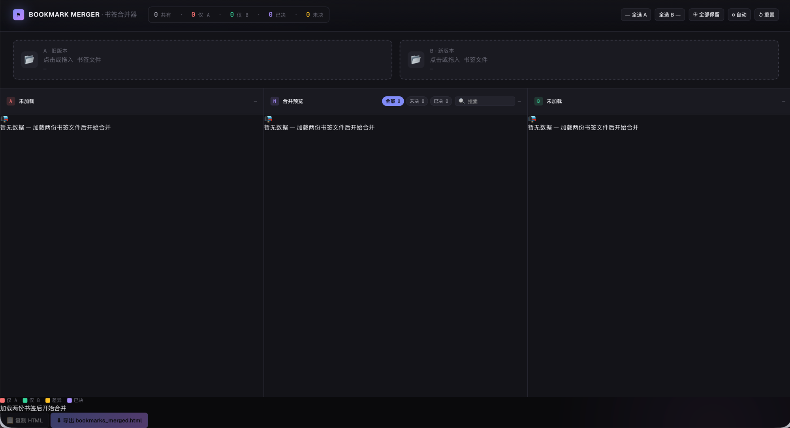

# Bookmark Merger · 书签合并器

> 像 Jetbrains IDE merge 工具那样，逐条决策两个浏览器导出的书签文件，**零上传、零依赖、零构建**。

---

## ✨ 这是什么

你有两个浏览器（Chrome、Edge、Safari、Firefox…），书签各攒一份，想统一到一份。

**Bookmark Merger** 是一个**单文件 HTML**（43 KB），打开浏览器就能用：

- 三栏 merge 风格布局：`左 A | 中 合并预览 | 右 B`
- 逐条 diff 高亮：**红 = 仅 A 删**、**绿 = 仅 B 增**、**黄 = 标题/文件夹有差异**、**紫 = 已决**
- 每条差异 4 个动作：`用 A` / `用 B` / `⊕ 保留两者` / `⊘ 跳过`
- 一键导出新的 Netscape Bookmark 格式 HTML，分别拖回两个浏览器即可

## 🖼 截图



---

## 🚀 快速开始

```bash
# 方式 1：直接双击
open bookmark-merger.html    # macOS
# 或在浏览器地址栏输入 file:// 路径

# 方式 2：本地起个服务（可选）
python3 -m http.server 8000
# 然后访问 http://localhost:8000/bookmark-merger.html
```

**步骤：**

1. **从浏览器 A 导出书签**
  - Chrome / Edge：`chrome://bookmarks` → 右上 ⋮ → 「导出书签」
  - Safari：菜单 → 文件 → 导出 → 书签
2. **从浏览器 B 同样导出**
3. **打开本工具**，把两份 HTML 拖到顶部的两个上传区
4. **逐条决策**中间栏的差异行
5. **底部导出** `bookmarks_merged.html`，分别拖回 A、B 两个浏览器覆盖导入

## 🧠 工作原理

### 数据流

```
   书签.html ──┐
               ├─→ parser.js 解析 → items[] ─┐
                                               ├─→ diff.js → rows[] ─→ render.js
  bookmarks_2026_6_16.html ──┘                  │                         │
                                               └─→ 同 normUrl 配对       └─→ 导出 HTML
```

### 解析（`parser.js`）

- 用浏览器内置的 `DOMParser` 解析 Netscape Bookmark 格式
- 对每个 `<A HREF>` 节点，**从其 ancestor 链向上找 DT 节点的 H3 名字**作为 folder 路径
- 顶层 H3（最外层那个）统一改名为「书签栏」，兼容不同浏览器的命名差异：
  - `书签栏` / `Bookmarks bar` / `Bookmarks Bar` / `个人收藏` / `书签菜单` → 都归为「书签栏」
- 同一 folder + 同一 URL 自动去重

### 匹配（`diff.js`）

- 归一化 URL（去 `www.`、去末尾 `/`、decode 后的 host 小写、拼回完整 URL）
- 用归一化 URL 作为 key 配对 A、B
- 三类差异：
  - `onlyA` — 仅 A 有
  - `onlyB` — 仅 B 有
  - `diff` — 两边都有但 folder 或 title 不同
  - `same` — 两边完全一致（自动 useA，无需决策）

### 合并决策

- 4 个动作：`useA` / `useB` / `keepBoth` / `skip`
- 中间栏实时显示决策结果
- 顶部快捷按钮：`全选 A` / `全选 B` / `全部保留` / `自动` / `重置`
- 中间栏 col-head 内置 chips（全部/未决/已决）和搜索框

### 导出

- 按 folder 分组，重新组装标准 Netscape Bookmark HTML
- 顶层文件夹统一为「书签栏」
- 下载文件名：`bookmarks_merged_YYYYMMDD.html`

## 🔒 隐私

- **100% 浏览器内运行**，没有任何网络请求
- **不上传**任何书签数据到任何服务器
- **不写 cookie**、**不引入外部 JS**（Google Fonts 除外，可断网使用）
- 关闭页面后所有数据立即消失（不持久化）

## 📜 许可证

MIT License — 随便用、商用、改、卖，只要你保留版权声明。

---

**Made with 🇨🇳 in Downloads/ · No tracking · No ads · No bullshit**